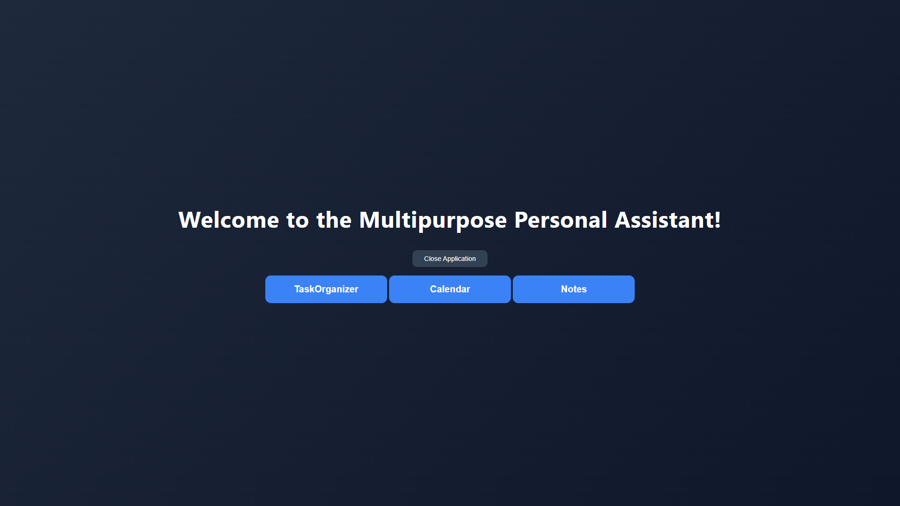
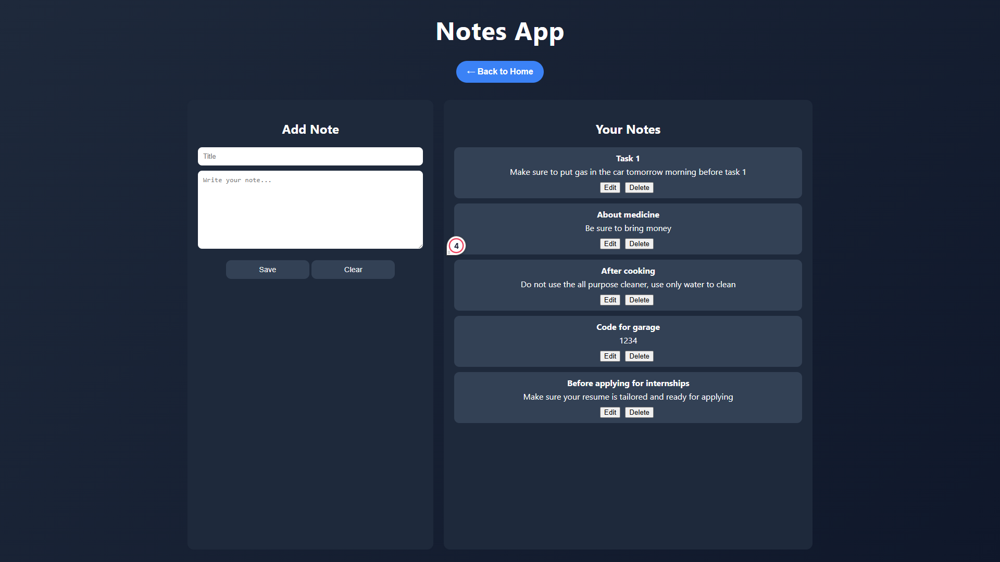
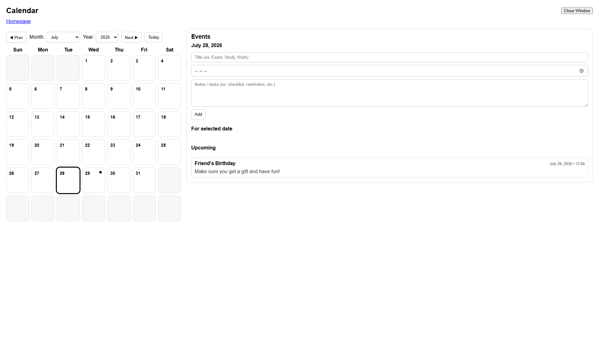
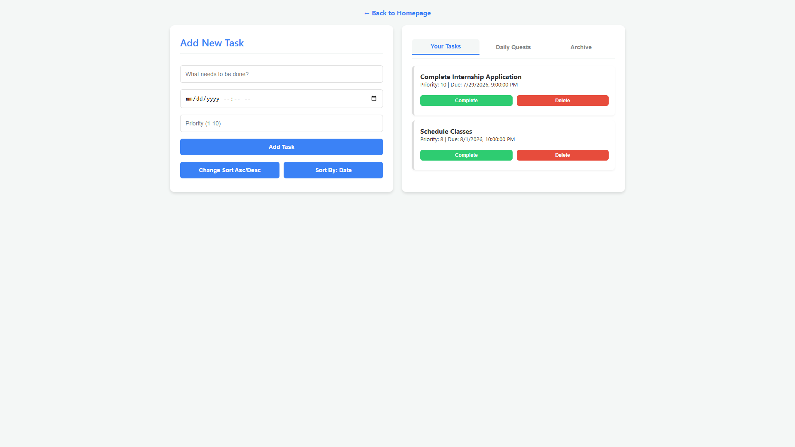
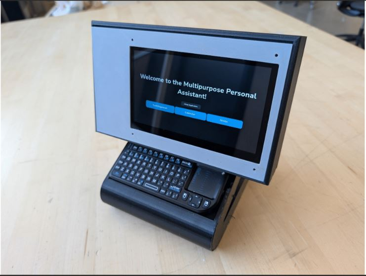

# Personal Digital Assistant

A Raspberry Pi-powered personal productivity device developed as a senior capstone project. The system combines task management, note-taking, and calendar scheduling into a standalone touchscreen application built with Electron.

## Features
- Task Organizer
- Notes Application
- Calendar Management
- Raspberry Pi Deployment
- Touchscreen Interface
- Persistent Data Storage

## Technologies
- Electron
- JavaScript
- HTML
- CSS
- Node.js
- SQLite
- Raspberry Pi

## My Contributions
- Developed the Notes module, including note creation, editing, deletion, and persistent local storage.
- Collaborated with teammates to design a consistent application workflow and user interface.
- Assisted with integrating the Notes module into the overall Electron application.
- Participated in testing and debugging to ensure a stable user experience.
  
## Screenshots

### Home Screen

### Notes Module

### Calendar Module

### Task Organizer

## Hardware

The application was deployed on a Raspberry Pi with a touchscreen display and keyboard, allowing it to function as a standalone personal productivity device.

